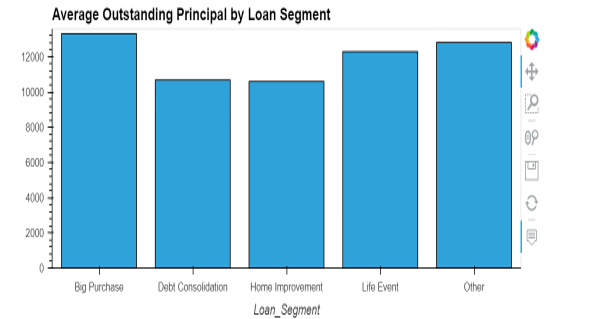
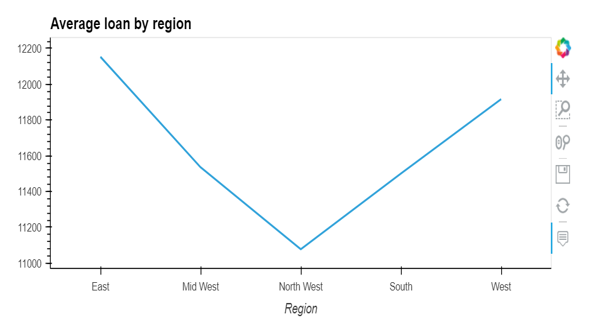

# Project 1: Strategy and Decision Tool:
Company Name: K2M2 Lending: Provide personal loans to individual consumers

## Problem
* Currently the analytics is reviewed manually using excel which is prone to human error
* Reviewing the big data manually is costly and time consuming
* Delay in management actions 
## Solution
* Build an automatic analysis tool for the management to make profitable decisions
* Management has access to timely data to make swift strategic decisions
## Data Type
* Loan data for personal loans focused on debt consolidation, home improvement etc.
* Data Range: YTD 2022

## Approachs

### Accounting

The approach for building the accounting entry is below:    

1) Import two tables from excel file. One for Loan data, the other for HFI & HFS data.      
2) Clean up the data by stripping spaces of each column title.    
3) Build an aggregation formula for each column of the dataset that has numerical values    
    •	Use for loop instead of sum() on each column in order to make the code more efficient
3) Perform some additions and subtractions to validate the ending balance of the loan.    
4) Merge HFI&HFS table into Loan data table, only merging those which the loan ID matched   
5) Create table by using pd.DataFrame() for each journal entry.     
6) Combined all table into one big table for purpose of booking entry in Quickbook   

### Sales

The approach for building the Sales Jupyter notebook:

1. Import necessary Python libraries.
2. Import data using the Accounting tool provided.
3. Determine necessary data to develop story.
4. Group the data by regions in order to display charts in an effective manner to the audience.
5. Display various charts.
6. Create story based on interpretation of data.

### Marketing

The approach for building the marketing analytics is below:    

1) Import one tables from loan data excel       
2) Create a numerical aggregation that groups the data by the year and then averages the results.    
3) Review the DataFrame    
3) Create a visual aggregation explore the Average outstanding principal by different segment    
 
 
 
 
 
 
 ### CCO/Wrap-up

Show the overall health of the portfolios and loan performanmce for the company.

1) Create Pie chart showing the status of loans that are for investment vs loans that are not.
2) Use various scatter plots to show the relationships between Loans that are past due vs loan amount, loan segment, and Fico Score
3) Tie in the information provided by the accountant, marketing and sales managers to show how K2M2 is perfoming so far.
4) 
5) 

